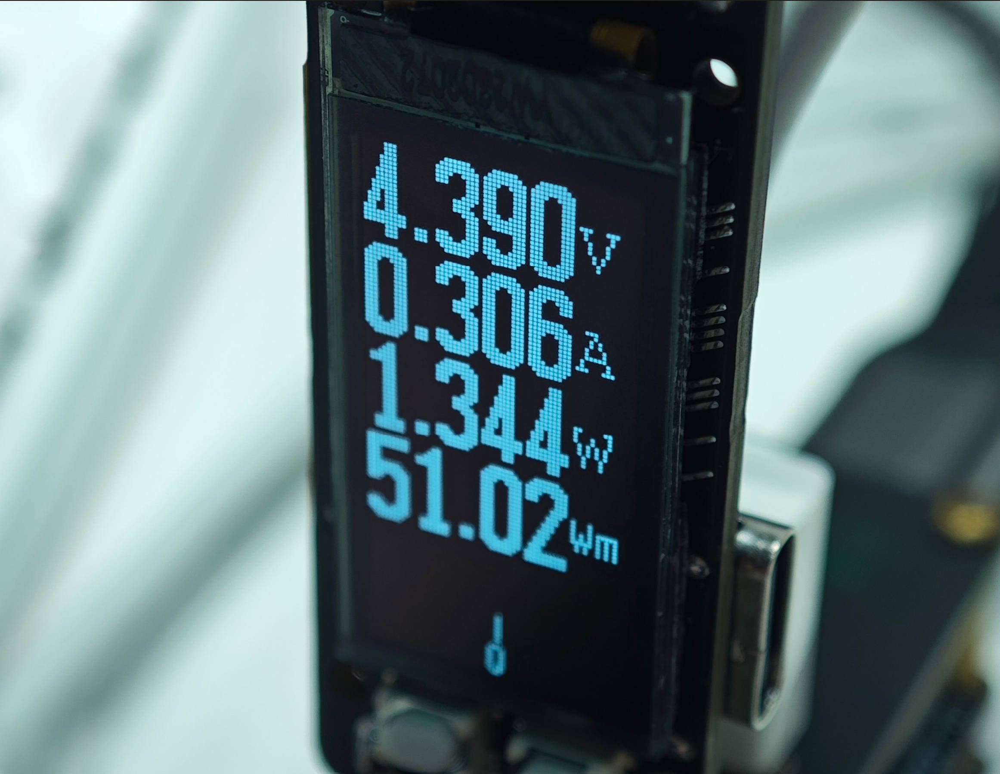

# usbMeter

简易 usb 电流表，精度 1mA，支持正负 4.0A 电流测量。

## 实物

## 更新注记

### V1.0.0

实现了最基础的电压、电流、功率的读取和显示

### V0.0.1

这个版本是最初的版本，具有我能够塞入的所有功能，结果发现嘉立创免费打样只支持0.3mm的孔，导致没有办法低价进行生产，随放弃，删除大量功能，只保留了最基本的功能，做出了 V1.0.0 版本